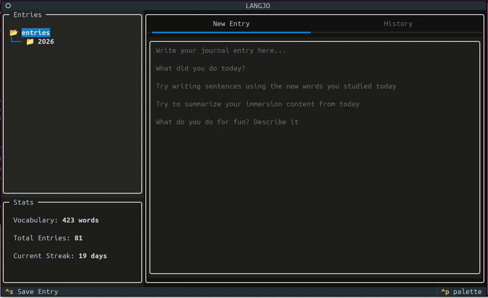

# Langjo


A terminal-based journaling tool for language learning built with [Textual](https://textual.textualize.io/)

<p align="center">
  
</p>

Often the barrier to writing journals when learning a language is the writing system itself. [Japanese](https://en.wikipedia.org/wiki/Japanese_writing_system), for example, uses two syllabaries and tens of thousands of individual logographic characters. Langjo lowers this barrier and makes building a daily journaling habit attainable for learners. At the same time, it analyzes each entry to generate useful data such as vocabulary growth and writing streaks, turning daily practice into trackable progress.


#### Supported Journaling languages
- Japanese
- TBD...

### Why Journaling?
Journaling is a powerful language learning tool that offers a low-stakes environment to experiment with new vocabulary and grammar structures whilst strengthening neural pathways as the entries are often personally relevant.

## Features

- **Daily Journaling:** Write and save entries as 'YYYY-MM-DD.md' files.
- **Multiple Daily Entries:** Further entries are appended to that day's markdown file.
- **Entries Automatically Organised:** Entries are saved in a local directory tree in 'YEAR/MONTH/YYYY-MM-DD.md' format.
- **Vocab Tracking:** Journal entries are parsed and normalized into their dictionary form with [Sudachipy](https://pypi.org/project/SudachiPy/0.4.3/), new vocabulary is then saved to a vocab list.
- **History Browser:** Previous entries can be selected via the file tree and viewed to track output improvement over time.
- **Streak Tracking:** Daily entry streak is tracked and displayed.
- **Live stats:** View your total vocabulary, entry count and streak.

## Prerequisites

### Japanese Input Setup

To write journal entries in Japanese you will need a Japanese input method.

**Linux:**
  Install ibus-mozc or fcitx-mozc

**Mac:**
  System Settings → Keyboard → Input Sources → Japanese

**Windows:**
  Settings → Time & Language → Japanese Keyboard

### Japanese Font

You will also want to make sure your [Font](https://learnjapanese.moe/font/) displays the Japanese version of Kanji characters.

## Installation

**Install**
```sh
git clone https://github.com/edwardpeart/langjo
cd langjo
python -m venv .venv
source .venv/bin/activate
pip install -e .
```

**Run**
```sh
langjo
```

## Usage

| Key | Action |
|----|----|
| **Ctrl + S** | Save entry and update stats |
| **Tab** | Switch between UI areas |
| **↑ / ↓** | Navigate file tree |
| **Enter** | Select folder/file |
| **Ctrl + Q** | Quit Langjo |

## Roadmap
- [ ] Multi-language support (separate storage per language)
- [ ] Move from local to SQL database storage
- [ ] Package/dockerize tool
- [ ] Export vocab list for Anki import
