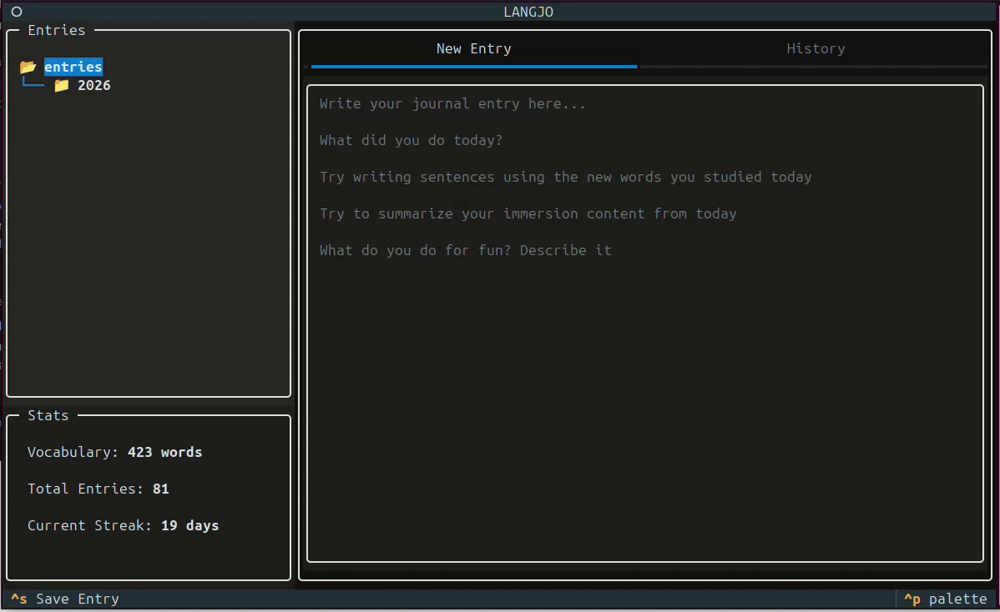

# Langjo


## Table of Contents

- [File Structure](#file-structure)
- [Tech Stack](#tech-stack)
- [Features](#features)
- [Intro](#intro)
- [Installation](#installation)
- [Run the API](#run-the-api)
- [API Examples](#api-examples)
- [Textual UI](#textual-ui)
- [User Prerequisites](#user-prerequisites)
- [Usage](#usage)
- [Database Migrations](#database-migrations)
- [Roadmap](#roadmap)

## File Structure

```text
langjo/
├── backend/
│   ├── app/
│   │   ├── api/
│   │   │   └── routers/
│   │   ├── db/
│   │   │   ├── migrations/
│   │   │   ├── models/
│   │   │   ├── repositories/
│   │   │   └── schemas.py
│   │   ├── services/
│   │   ├── config.py
│   │   ├── cli.py
│   │   └── main.py
│   └── pyproject.toml
├── frontend/
│   └── textual_ui/
├── assets/
├── alembic.ini
├── .env
├── README.md
├── example.README.md
├── pyproject.toml
└── tests/
```

## Tech Stack

- FastAPI
- SQLAlchemy
- PostgreSQL
- Alembic
- JWT auth
- Python 3.12+
- Textual for the optional terminal client
- Sudachi for Japanese parsing

## Features

- **API-first backend:** FastAPI, PostgreSQL, SQLAlchemy, JWT auth, and Alembic migrations.
- **Daily Journaling:** Write and save entries as journal content stored in the database.
- **Multiple Daily Entries:** Users can create and maintain multiple journal entries with timestamps.
- **Vocab Tracking:** Journal entries are parsed and normalized into dictionary form with [Sudachipy](https://pypi.org/project/SudachiPy/0.4.3/), and new vocabulary is saved per user.
- **History Browser:** Previous entries can be retrieved and reviewed through the API or the optional Textual client.
- **Streak Tracking:** Daily entry streaks are calculated against each user’s local time.
- **Live stats:** View total vocabulary, entry count, and streak through the API and stats endpoints.

## Intro


Often the barrier to writing journals when learning a language is the writing system itself. [Japanese](https://en.wikipedia.org/wiki/Japanese_writing_system), for example, uses two syllabaries and tens of thousands of individual logographic characters. Langjo lowers this barrier and makes building a daily journaling habit attainable for learners. At the same time, it analyzes each entry to generate useful data such as vocabulary growth and writing streaks, turning daily practice into trackable progress.

#### Supported Journaling languages
- Japanese
- TBD...

### Why Journaling?
Journaling is a powerful language learning tool that offers a low-stakes environment to experiment with new vocabulary and grammar structures whilst strengthening neural pathways as the entries are often personally relevant.


## Installation

**Install**
```sh
git clone https://github.com/edwardpeart/langjo
cd langjo
python -m venv .venv
source .venv/bin/activate
pip install -e .
```

## Run the API

```sh
langjo-api
```

Or:

```sh
cd langjo
source .venv/bin/activate
export PYTHONPATH=$PWD
uvicorn backend.app.main:app --host 0.0.0.0 --port 8000 --reload
```

Then open:
- http://localhost:8000/docs
- http://localhost:8000/health

## API Examples

### Health check
```sh
curl http://localhost:8000/health
```

### Sign up
```sh
curl -X POST http://localhost:8000/auth/signup \
  -H "Content-Type: application/json" \
  -d '{
    "username": "demo_user",
    "email": "demo@example.com",
    "password": "secret123"
  }'
```

### Log in
```sh
curl -X POST "http://localhost:8000/auth/login" \
  -H "Content-Type: application/x-www-form-urlencoded" \
  -d "username=demo_user&password=secret123"
```

### Get current user
```sh
curl -X GET http://localhost:8000/auth/me \
  -H "Authorization: Bearer YOUR_TOKEN_HERE"
```

### View entries
```sh
curl -X GET http://localhost:8000/entries \
  -H "Authorization: Bearer YOUR_TOKEN_HERE"
```

### View vocab
```sh
curl -X GET http://localhost:8000/vocab \
  -H "Authorization: Bearer YOUR_TOKEN_HERE"
```

### View stats
```sh
curl -X GET http://localhost:8000/stats \
  -H "Authorization: Bearer YOUR_TOKEN_HERE"
```

## Textual UI

A terminal-based journaling tool for language learning built with [Textual](https://textual.textualize.io/)

<p align="center">
  
</p>


### User Prerequisites

#### Japanese Input Setup

To write journal entries in Japanese you will need a Japanese input method.

**Linux:**
  Install ibus-mozc or fcitx-mozc

**Mac:**
  System Settings → Keyboard → Input Sources → Japanese

**Windows:**
  Settings → Time & Language → Japanese Keyboard

#### Japanese Font

You will also want to make sure your [Font](https://learnjapanese.moe/font/) displays the Japanese version of Kanji characters.

### Usage

The Textual app remains available as a local terminal client while the web frontend is being built.

```sh
cd langjo
source .venv/bin/activate
langjo-tui
```

| Key | Action |
|----|----|
| **Ctrl + S** | Save entry and update stats |
| **Tab** | Switch between UI areas |
| **↑ / ↓** | Navigate file tree |
| **Enter** | Select folder/file |
| **Ctrl + Q** | Quit Langjo |

## Database Migrations

```sh
cd langjo
source .venv/bin/activate
export PYTHONPATH=$PWD
alembic -c alembic.ini current
alembic -c alembic.ini upgrade head
```

Or use the shortcut commands:

```sh
langjo-migrate
langjo-upgrade
langjo-downgrade
```

## Roadmap
- [ ] User timezones for streak accuracy
- [ ] Package/dockerize tool
- [ ] Build the web frontend on top of the API
- [ ] Deploy the API for demo and usage
- [ ] Multi-language support
